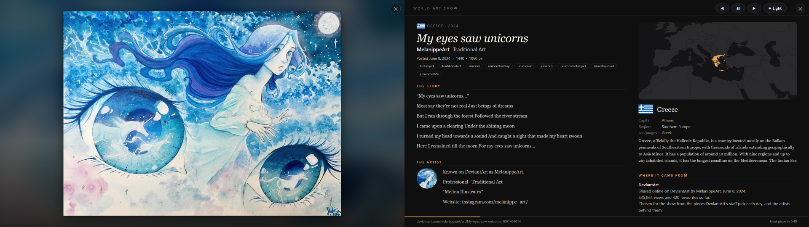

# World Art Show

New art by living artists from around the world, a new piece every 60 seconds. On your computer it fills two screens: the art on the left, and its story on the right. On an iPad it's a home-screen app that works in portrait and landscape.

- **Art made by hand or on a computer:** paintings, drawings, watercolors, prints, collages and digital art. No photography, no photos of objects, no AI-made images, no fan art or video game art.
- **New work:** made in 2010 or later, by artists alive today.
- **Travels the world:** each piece is picked by country first. The same artist doesn't come back until hundreds of others have had a turn, and pieces don't repeat.
- **Same frame every time:** each piece is shown whole, never cropped, and the space around it is filled with a soft, blurred copy of the piece.
- **Bottom right (iPad):** the artist, their country, the title and year, and the link to the piece at its source.
- **Always fresh:** GitHub rebuilds the art list every 3 hours, and the show loads the newest list every time it opens.

The show: **https://dylaneinsidler.github.io/World-Art-Show/**

## On the computer

Right-click `install.ps1` > **Run with PowerShell**. This puts a **World Art Show** shortcut on your Desktop. Double-click it and the show fills both monitors (on one monitor, the two screens stack). Needs Google Chrome or Microsoft Edge.

- **Left screen: the art,** a new piece every minute, whole and as large as it fits.
- **Right screen: everything about it.** The title, artist and year; what it's made of and how big it is; **the story** behind it (the museum's own words, or the artist's own description on DeviantArt); **the artist** (their Wikipedia biography and photo for museum artists, or their DeviantArt profile); **their country** on a world map, with its flag, capital, region, languages and a short introduction; and **where it came from**: the museum and city (with a line on the map from the artist's country to the museum), or when it was shared on DeviantArt. Long text scrolls slowly by itself while the piece is up. Along the bottom: the link to the piece and the time until the next one.

| | |
|---|---|
| **◀ ❚❚ ▶** on the right screen, or **← Space →** | previous piece, pause / resume, next piece |
| **☀ Light / ☾ Dark** on the right screen | switches both screens; it's remembered for next time |
| **Digital art: Off / On** on the right screen | only the museums' paintings, drawings and prints (Off, the usual), or DeviantArt's digital art too; remembered |
| **✕** in the top right corner of either screen, or **Esc** | closes both screens |

The screens stay on for up to 4 hours while it's open. It runs from a copy in `AppData\Local\WorldArtShow\app` that `start.ps1` refreshes from this folder on every start, so edit the files here, not the copy. The two screens talk through a tiny web server that `launch.ps1` runs and only this PC can reach (`http://localhost:47233`); it also looks up DeviantArt pieces for the right screen with your DeviantArt key (below), so it never leaves the PC. `country-facts.js` (capitals, regions, languages) is made by `tools/make_country_facts.py`.

## On the iPad

1. Open **https://dylaneinsidler.github.io/World-Art-Show/** in Safari.
2. Tap the **Share** button > **Add to Home Screen** > **Add**.
3. Open **World Art Show** from the home screen. It runs full screen and keeps the screen awake. Held sideways it shows landscape pieces; held upright, portrait pieces (near-square pieces show both ways). Turn it and a piece that no longer fits is replaced.

Swipe left for the next piece, swipe right to go back, tap to pause.

On both: tap or click the link under a piece to open its page at the museum or on DeviantArt. While the show is minimized, covered or in the background, it waits, so each piece gets its full minute on screen.

## Where the art comes from

- [Art Institute of Chicago](https://www.artic.edu/open-access/public-api) (USA)
- [Minneapolis Institute of Art](https://collections.artsmia.org/) (USA)
- [SMK – National Gallery of Denmark](https://open.smk.dk/en) (Denmark)
- [DeviantArt](https://www.deviantart.com/daily-deviations): the pieces its staff pick each day (Daily Deviations), plus the last 12 months of new work by those artists (each one's gallery is checked every few days), once a key is set up (below). Judged by each piece's tags: only pieces tagged as painted, drawn or made digitally, and not photographs, AI-made images, fan art, video game or pixel art, crafts, or character-sale posts.

Museum artists need a recorded birth year, no recorded death, and a birth year of 1925 or later. Museums can take years to record a death, so each one is also checked against [Wikidata](https://www.wikidata.org/) (matching name and birth year). Pieces whose only picture isn't the artwork itself (a photo of the gallery room) can be listed in `tools/leave_out.txt`.

## Setting up DeviantArt

DeviantArt needs a free developer key, and it blocks requests from GitHub's servers, so the PC collects its picks and sends them up:

1. Sign in at [deviantart.com](https://www.deviantart.com/) (free account), then go to [deviantart.com/developers](https://www.deviantart.com/developers/) > **Register your Application**.
2. Fill in a title (World Art Show) and a description, set **OAuth2 Grant Type** to *Client Credentials*, put `https://dylaneinsidler.github.io/World-Art-Show/` in the redirect and original URL whitelists, agree to the terms and save.
3. Run `install.ps1` (if you haven't), then open `%LOCALAPPDATA%\WorldArtShow\deviantart-key.txt` in Notepad, replace the two "paste ..." parts with your **client_id** and **client_secret**, and save.

From then on the PC collects DeviantArt's newest picks when the show opens (at most every 6 hours) and once a day at 9 AM (or as soon as the PC is on after that), and sends them to GitHub, which adds them to the show. What it did is logged in `%LOCALAPPDATA%\WorldArtShow\deviantart.log`.

## How it works

`index.html` is the whole show. `tools/build_catalog.py` gathers the art list (`catalog.json`) from the sources above and merges in `deviantart.json`, which `tools/fetch_deviantart.py` sends up from the PC; `.github/workflows/update.yml` runs the build every 3 hours (and whenever new DeviantArt picks arrive) and publishes the show to GitHub Pages. On the computer, `launch.ps1` opens the website in its own browser window (with its own profile, so it never touches your normal browser); `launch.vbs` starts it without a console window flashing.

To build the art list yourself (Python 3): `python tools/build_catalog.py`. It prints how many works, artists and countries it found, and any nationalities it didn't recognize (add those to `tools/countries.py`).
